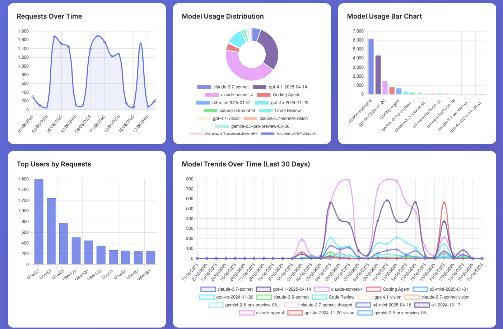
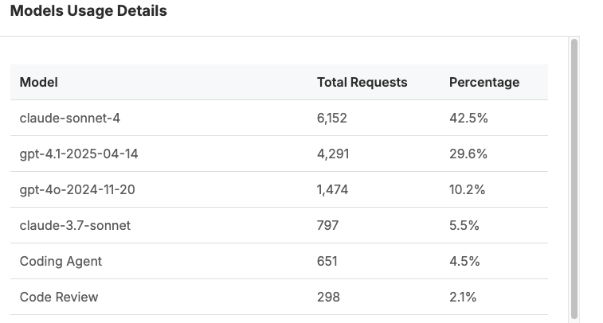

# GitHub Copilot Usage Metrics Viewer
📊 Interactive dashboard for visualising GitHub Copilot Premium requests usage metrics and analytics

A web-based dashboard that provides insights into GitHub Copilot Premium requests usage patterns, model distribution, user activity, and hourly trends. Built as a single-page application with no external dependencies.

🚀 Ready to use in seconds! Just open in your browser - no installation, no setup, no server required. All data processing happens locally for complete privacy.


---

## ✨ Features
- 🔒 **Privacy-First**: All data processing happens locally in your browser - no external transmission
- ⚡ **Zero Setup**: Just open in any modern browser - no installation or configuration required
- 📊 **Overview Analytics**: Total users, requests, model distribution, and top users etc
- 🔍 **Advanced Analytics**: Hourly usage patterns, filtering by date, user, or model
- 💡 **Insights Dashboard**: Interactive charts, real-time search, and exportable filtered data

### Dashboard Preview





---

## 🚀 Getting Started

### Option 1: GitHub Pages (Recommended)
✨ Instant access: Deploy the dashboard to GitHub Pages and access it at: `https://[username].github.io/[repository-name]/`

### Option 2: Local Usage
📁 Download and go: Clone the repository and open `index.html` in your browser  
📊 Load your data: Click "📁 Load Data" and upload your GitHub Copilot metrics CSV file  
💡 No server required: The dashboard works directly from your file system - just double-click and open!

### Option 3: Clone/Fork and Deploy
Clone or fork the repository and run it with your own GitHub Actions to deploy to your own GitHub Pages or other hosting platforms. The included GitHub Actions workflow in `.github/workflows/deploy.yml` automatically deploys to GitHub Pages on push to the main branch.

---

## 🧪 Sample Data
A sample dataset (`data_example.csv`) is included in the repository to help you:
- Explore the dashboard features without your own data
- Understand the expected data format
- Test new features during development

The sample data includes:
- Timestamps, user identifiers, model names, and request counts
- Realistic usage patterns for testing and exploration

---

## 📋 Getting Your Data
Ready to see your own Copilot insights? Here's how to get your data in 3 simple steps:

1. Export your GitHub Copilot usage metrics as a CSV file.
2. Ensure the file matches the expected format:
   ```csv
   Timestamp,User,Model,Requests Used,Exceeds Monthly Quota,Total Monthly Quota
   2025-06-18T10:43:41.8378480Z,User41,gpt-4o-2024-11-20,1,FALSE,Unlimited
   ```
3. Load the file into the dashboard by clicking "📁 Load Data".

---

## 🛠️ Technical Details
- **Built With**: HTML5, CSS3, vanilla JavaScript, and Chart.js
- **Browser Compatibility**: Works in all modern browsers (Chrome, Firefox, Safari, Edge)
- **Performance**: Client-side CSV parsing for fast data loading and efficient filtering

---

## 📖 Usage Examples
- **Enterprise Teams**: Monitor GitHub Copilot Premium request adoption, track usage trends, and optimize licensing
- **Individual Developers**: Personal productivity tracking, model-specific insights, and usage patterns

---

## 🤝 Contributing
We welcome contributions! Please see `CONTRIBUTING.md` for guidelines.

1. Fork the repository  
2. Create a feature branch  
3. Make changes  
4. Test thoroughly  
5. Submit a pull request  

---

## 📄 License
This project is licensed under the MIT License - see the `LICENSE` file for details.

---

## 🆘 Support
For issues, questions, or contributions:
- Check the [Issues](../../issues) section
- Create a new issue with detailed information
- Consider contributing improvements via pull requests

---

Built with ❤️ for GitHub Copilot users who want to understand their usage patterns.